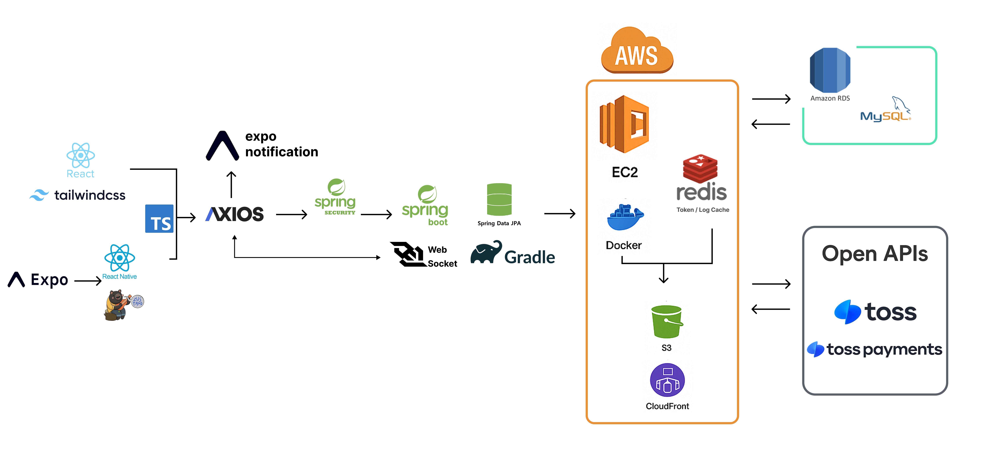
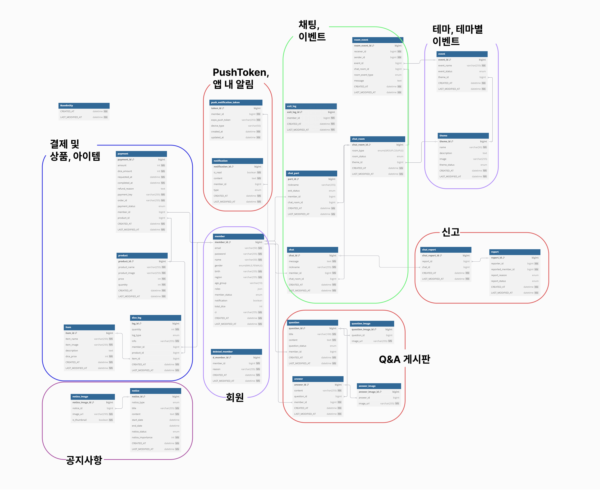
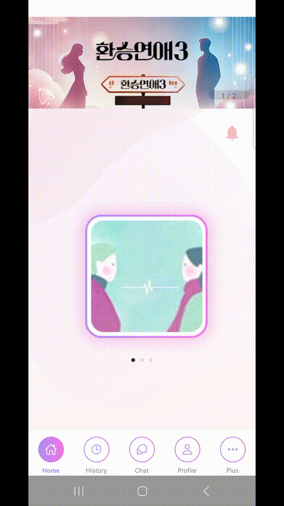
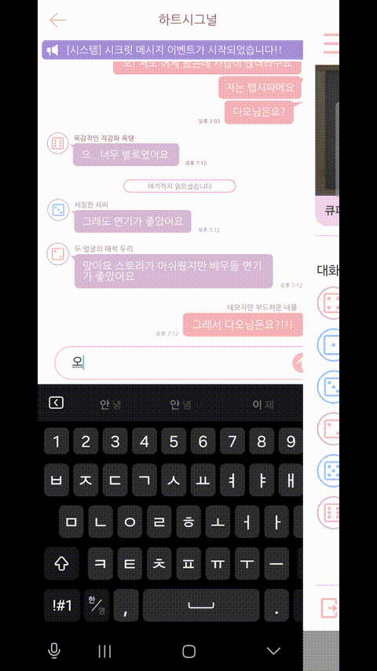
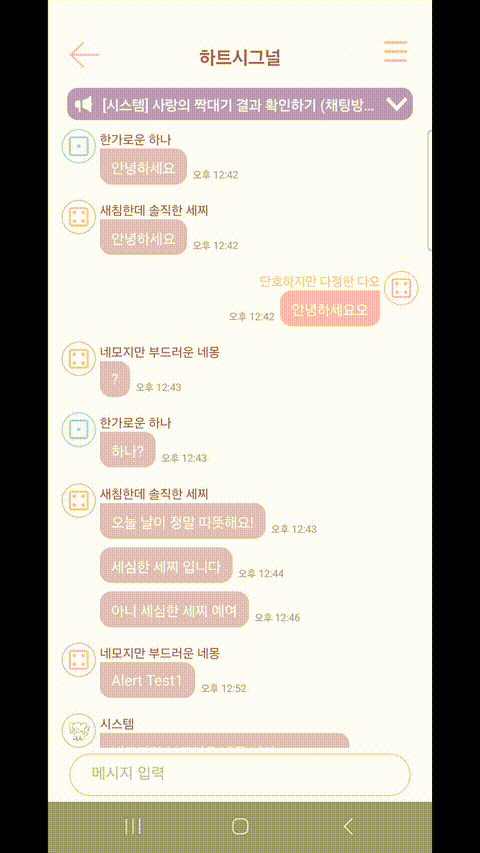
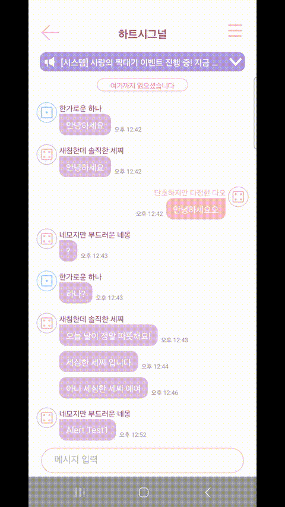

# 다이스톡

## 프로젝트 소개
다이스톡은 익명성을 기반으로 사용자들이 자유롭게 소통할 수 있는 모바일 채팅 애플리케이션입니다. React Native/Expo 기반의 크로스플랫폼 앱으로 개발되었으며, 사용자들에게 빠르고 혁신적이며 안전한 채팅 경험을 제공하는 데 집중했습니다.
- 타입: 익명성 기반 채팅 및 소셜링 모바일 애플리케이션
- 플랫폼: React Native/Expo 기반의 Android 앱
- 개발 기간 : 약 2개월
- 배포: EAS Build를 통한 APK 파일 배포(스토어 미배포)
- Repo : https://github.com/dice-talk

## 🤝 팀원 구성

| 강민지 | 구본석 | 남택호 [팀장]                                                 | 여승아                                                 |
|--|--|-----------------------------------------------------|-----------------------------------------------------|
|  |  |  |  |
| [@KangMinJi](https://github.com/minggiK) | [@6feetlife](https://github.com/6feetlife) | [@NamTaekHo](https://github.com/NamTaekHo)          | [@YeoSeungA](https://github.com/YeoSeungA )         |

## 🏗️ 프로젝트 아키텍처
  

## 🔧 Development Setup

### Frontend

- **Languages / Frameworks**: TypeScript, React Native, React, Expo
- **State Management**: Zustand, TanStack Query
- **Networking**: Axios
- **Styling**: StyleSheet, Tailwind CSS
- **Build & Deployment**: EAS, Expo Go

### Backend

- **Language / Framework**: Java 11, Spring Boot
- **Security & Auth**: Spring Security, JWT
- **Database**: MySQL (RDS), Redis (Token / Log), Spring Data JPA
- **Build Tool**: Gradle
- **API Docs**: Swagger

### DevOps / Infra

- **Cloud**: AWS EC2, S3, RDS
- **Container**: Docker
- **CI/CD**: GitHub Actions
- **IDE**: IntelliJ, VSCode

### Tools

- **Version Control**: GitHub
- **Communication / Docs**: Discord, Notion
- **Design Tool**: Figma

## 🛠 기술 스택

  <!-- Frontend -->
  
  
  
  
  
  
   

  <!-- State Management & API -->
  
  
  
   

  <!-- Backend -->
  
  
  
  

  
  
  
   

  <!-- Infra & DevOps -->
  
  
  
  
  
  
   

  <!-- 협업 도구 -->
  
  
  
  
   

  <!-- IDE -->
  
  

### ERD

 

## 🚩 서비스 구현 기능
### 📱 주요 기능(App)

| 앱 실행                                              | 로그인                                             |
|---------------------------------------------------|-------------------------------------------------|
|  |  |

| 회원가입 | 메인화면                                   |
|------|---------------------------------------------------|
| 내용1  | 내용2|

| 채팅 | 채팅룸 나가기 |
|-------------------------------------------------------------------|--------------------------------------------------------|
|  |  |

| 채팅 이벤트1 | 채팅 이벤트1 결과 확인                                                      |
|---------------------------------------------------------|----------------------------------------------------------------|
|  | |

| 채팅 이벤트2 | 채팅 이벤트2 결과 확인                                                      |
|---------------------------------------------------------|----------------------------------------------------------------|
|  | |

| 채팅 이벤트2 | 채팅 이벤트2 결과 확인                                                      |
|---------------------------------------------------------|----------------------------------------------------------------|
|  | |

| 채팅 이벤트2 missMatch 결과                                                |
|----------------------------------------------------------------|
| |

| 신고하기 |
|-----------------------------------------------------------|
| |

| 히스토리 (1대 1 채팅) | 히스토리 (하트 히스토리) |
|--------------------------------------------------------|-------------------------------------------------|
|  |  |

| 마이페이지 문의하기 | 마이페이지 결제 및 사용 내용  |
|--------------------------------------------------------|-------------------------------------------------|
|  |  |

| 마이페이지 결제하기 | 공지사항 조회  |
|--------------------------------------------------------|-------------------------------------------------|
|  |  |

| 비회원 문의하기 | Push 알림  |
|--------------------------------------------------------|-------------------------------------------------|
|  |  |

| ????? | ?????  |
|--------------------------------------------------|-------------------------------------------------------------|
|  |  |

### 🖥️ 주요 기능(Web)

| 로그인 | |
|--------------|---------------------------------------------------------------------------------------------------|
| 메인페이지 | |
| 회원 조회 | |
| QnA 필터링 | |
| QnA 답변 생성 |  |
| QnA 답변 수정 |  |
| QnA 답변 삭제 | |
| 공지사항 조회 및 수정 |  |
| 공지사항 삭제 |  |

## 📌 주요 기능 
### 1. WebSocket을 사용한 실시간 채팅 구현

- STOMP 웹소켓에 연결하여 특정 채팅방 토픽을 구독하고, 오가는 메시지들을 특정 경로로 소켓 발행하여 백엔드에서 메시지들을 DB에 저장 후 채팅방 구독자들에게 전송하는 방식으로 구현.
- 채팅 대기열(Queue): Redis 등을 활용한 전역 리스트로 현재 대기중인 사용자들을 관리한다.
기다리는 사용자가 선택한 옵션에 맞는 대기열이 없다면 대기열을 생성하고, 있다면 추가.
인원수가 조건에 충족되었을때 채팅방을 생성하고 대기중인 회원들을 채팅방으로 이동시키는 기능 구현

### 2. Toss Payments 연동 (본인인증 및 결제)

- 본인인증: 아이디/비밀번호 찾기 프로세스에 Toss Payments의 본인인증 기능을 연동하여 사용자 계정의 보안을 강화했습니다.
- 결제 시스템 심화 구현: React Native 환경에서 Toss Payments 결제 연동 시 발생하는 복잡한 문제들을 해결하고 안정적인 결제 시스템을 구축했습니다.

### 3. 푸시 알림 시스템 구현 
- Expo Push Notification을 활용하여 새로운 메시지, 공지사항 등 다양한 이벤트에 대한 실시간 푸시 알림 기능을 프론트엔드와 백엔드에 걸쳐 구현했습니다.

### 4. 자동 로그인 및 사용자 세션 관리 
- 토큰 기반 인증 구현: AccessToken과 RefreshToken을 활용한 JWT(JSON Web Token) 기반의 인증 시스템을 구현했습니다. 로그인 시 서버로부터 발급받은 토큰을 AsyncStorage에 안전하게 저장하여 사용자 세션을 유지합니다.

### 5.

### 6. 기타 기능

- QnA
    - 사용자 문의 작성
    - 문의 답변 확인
    - 문의 상태 관리
- 공지사항
    - 중요 공지 상단 표시
    - 공지사항 목록 조회
    - 첨부파일 등록
- 프로필 관리

    - 닉네임 설정
    - 생년월일 설정
    - 지역 설정
    - 계정 삭제

## 👥 구성원 별 담당 내용
### 강민지

[관리자 웹페이지 기능, 테스트 코드, CI/CD, AWS CLOUD 관리]

> ###  [BE]
- 

> ### AWS CLOUD 관리 & git Actions CI/CD 배포 자동화 [BE]

- AWS EC2
  - 배포를 위한 EC2 환경 구성 및 redis 관리
  - 도메인 연결 및 HTTPS 적용으로 보안 및 안정성 강화
  - AWS EC2 인스턴스, IAM 권한 및 보안 그룹 구성
- Git Actions/Docker를 활용한 CI/CD 배포 자동화 구현
  - 코드를 dev 브랜치에 푸시할 때마다 자동으로 빌드 및 테스트 실행
  - AWS EC2 인스턴스에 Docker 이미지를 자동 배포하여 안정적인 서비스 운영 환경 구축

- 웹 호스팅
  - AWS S3를 사용한 관리자용 웹사이트 호스팅
  - CloudFront를 통한 CDN 설정 및 최적화
  - Route 53을 이용한 도메인 설정 및 HTTPS 적용
    
> ### 관리자 웹 페이지 [FE]
 -

### 웹 (관리자용)

> ### 메인 페이지 [FE]

- 실시간 회원가입 수, 미답변 QnA 개수, 최신 공지 표시
- 사용자 경험을 고려한 직관적 대시보드 UI

> ### 회원 관리 페이지 [FE]

- 회원 목록 필터링 (정렬, 검색) 기능 구현
- 회원 전체조회, 상세조회 (모달 형식)

> ### QnA 관리 페이지 [FE]

- 질문 전체조회, 상세조회, 답변 생성/수정/삭제
- QnA 미답변 필터링으로 신속한 답변 처리 가능

> ### 공지 페이지 [FE]

- 공지 생성, 조회, 수정, 삭제
- 중요 공지사항 고정 기능 (우선순위 높은 공지 표시)

> ### 테스트 코드 [BE]
- 

> ### 그 외 
- 

### 남택호

[회원 관리, 매칭 시스템, 채팅방 관리, 결제 시스템, 관리자 대시보드, 신고 시스템, 알림 시스템, Redis 인프라]

> ### 관리자용 회원 관리 시스템 [BE, FE]

- 회원 관리 API 설계 및 구현
    - 회원 목록 조회 (검색, 필터링, 페이징)
    - 정지된 회원 관리
    - 탈퇴 회원 관리

> ### 매칭 시스템 [BE]

- 실시간 매칭 큐 시스템 설계 및 구현
    - 테마별, 지역별, 연령대별 대기열 분리
    - Redis를 활용한 실시간 상태 전송
    - WebSocket을 통한 매칭 상태 실시간 알림
    - 대기열 관리 및 정리 로직
    - 매칭 완료 시 자동 채팅방 생성

- 매칭 알고리즘 구현
    - 6명 그룹 매칭 시스템
    - 대기열 인원 모니터링
    - 매칭 완료 시 자동 닉네임 할당

> ### 채팅방 관리 시스템 [BE]

- 채팅방 생성 및 관리 시스템
    - 그룹 채팅방 (49시간) / 커플 채팅방 (24시간) 자동 종료
    - 채팅방 참여자 관리
    - 채팅방 상태 관리 (활성/비활성)
    - 채팅방 공지사항 관리

- 닉네임 관리 시스템
    - 성별별 닉네임 풀 분리
    - Redis를 활용한 닉네임 할당/반환
    - 채팅방별 독립적인 닉네임 풀 관리

> ### 결제 시스템 [BE]

- Toss Payments 연동 시스템
    - 결제 요청 및 처리 API
    - 결제 상태 관리
    - 관리자용 결제 관리 시스템

- 상품 및 아이템 관리
    - 상품 등록/수정/삭제
    - 아이템 관리 시스템

> ### 관리자 기능 구현 [BE]

- 관리자 기능 구현
    - 회원 관리 (조회, 정지, 복구)
    - 신고 처리, 조회

> ### 신고 시스템 [BE]

- 신고 처리 시스템 설계 및 구현
    - 신고 접수 및 처리 워크플로우
    - 신고 상태 관리 (접수/처리중/완료)
    - 신고 내역 조회 및 관리
    - 신고자 정보 보호

- 신고 관리 API
    - 신고 목록 조회 (검색, 필터링)
    - 신고 상세 조회
    - 신고 처리 상태 업데이트
    - 신고 통계 조회
 
> ### AWS S3 이미지 관리 시스템 [BE]

- AWS S3 이미지 업로드 시스템 설계 및 구현

  - S3 버킷 설정 및 권한 관리
  - 이미지 업로드/수정/삭제 기능
  - UUID 기반 파일명 중복 방지
  - 이미지 URL 생성 및 관리
  - 삭제된 이미지 폴더 이동 처리

- 다중 이미지 관리 시스템

  - 공지사항 다중 이미지 업로드
  - 문의/답변 이미지 관리
  - 상품/아이템 이미지 관리
  - 테마 이미지 관리
  - 썸네일 이미지 처리

> ### 알림 시스템 [BE]

- 앱 내 알림 시스템 설계 및 구현
    - 이벤트 기반 알림 시스템
    - 알림 이벤트 핸들러
    - 알림 상태 관리
    - 알림 설정 관리

- 이메일 알림 시스템
    - JavaMailSender 활용
    - 이메일 템플릿 관리
    - 알림 이메일 발송 로직

> ### Redis 캐싱 [BE]

- 캐싱 전략 구현
    - 채팅방 별 닉네임 풀 캐싱
    - 임시 데이터 캐싱
    - 캐시 만료 및 정리 로직

> ### API 문서화 [BE]

- Swagger API 문서화
    - 모든 API 엔드포인트 문서화
    - DTO 스키마 정의
    - API 응답 예시 작성

 
### 구본석

[홈 화면 및 매칭 대기열, 실시간 채팅(WebSocket 연동), 채팅룸내 이벤트 로직 및 애니메이션 구현] 

> ### 실시간 채팅 및 웹소켓 연동 [FE]
- StompJS, SockJS 라이브러리를 활용한 WebSocket 통신 환경 구축
- 실시간 메시지 구독(subscribe) 및 발행(publish) 로직 구현
- 채팅방 입장/퇴장 등 사용자 상태 변화에 따른 실시간 데이터 처리
- Zustand 전역 상태와 연동하여 채팅 데이터 관리
> ### 홈 화면 및 매칭 대기열 시스템 [FE]
- 메인 테마 선택을 위한 캐러셀 UI 개발
- 매칭 옵션(지역, 연령) 설정 페이지 및 관련 컴포넌트(SelectBox, TextBox) 구현
- CustomBottomSheet 컴포넌트를 활용하여 동적인 매칭 플로우 UI/UX 설계
- 홈 화면 이벤트 배너 API 연동 및 UI 구현
> ### 채팅방 UI/UX 및 부가 기능 개발 [FE]
- 채팅방의 전체적인 UI/UX 설계 및 구현 (Header, Main, Message, Input)
- 다양한 정보를 포함한 사이드바 UI 개발 (접속 유저, 공지, 이벤트 타이머, 알림)
- 사이드바 내에서 상대방 프로필을 확인할 수 있는 기능 구현
- 불량 사용자 신고 기능 및 관련 모달 UI 개발
- 채팅방 나가기 시 재화를 차감하는 로직 및 확인 모달창 구현
- '여기까지 읽었습니다' 태그를 통해 메시지 읽음 상태를 시각적으로 표시하는 기능 구현
> ### 채팅방 인앱 이벤트 시스템 [FE]
- 채팅방 생성 시간을 기준으로 이벤트 플로우(시크릿 메시지 → 큐피드 짝대기 → 결과 확인)를 관리하는 로직 구현 (ChatRoom.tsx)
- ChatEventNotice 컴포넌트를 통해 현재 진행 중인 이벤트 단계와 남은 시간을 사이드바에 실시간으로 표시
- '비밀 편지' 이벤트에서 메시지를 작성하고(EnvelopeAnimation) 특정 유저에게 보내는(LoveLetterSelect) 기능 구현
- '큐피드 짝대기' 이벤트에서 원하는 상대를 지목(LoveArrow)하고 선택 결과를 API로 전송하는 기능 개발
- 이벤트 관련 API(EventApi.ts) 연동 및 데이터(PICK, PICK_MESSAGE) 관리
> ### Git 버전 관리 및 협업 [FE]
- feat/home, feat/chat 등 기능 단위 브랜치 전략 사용
- Pull Request 기반의 코드 리뷰 및 병합(Merge) 프로세스 참여
- 커밋 메시지 컨벤션을 준수하여 협업 효율성 증대

### 여승아
[앱 기능 구현(QnA, 공지사항, 프로필 관리), 알림 시스템, 상태관리, 빌드 및 배포]

> ### Toss Payments 연동(본인인증 및 결제) [FE]
- Toss Payments 본인인증 기능 연동
- 복잡한 결제 시스템 심화 구현
- WebView 및 외부 앱 연동 문제 해결
- Android queries 설정 및 네이티브 빌드 이해
- 커스텀 URL 스킴을 이용한 딥링킹 구현

> ### 알림 시스템 [FE, BE]

- 푸시 알림 시스템 설계 및 구현
    - Expo Notifications를 활용한 푸시 알림 시스템 설계 및 구현
    - 알림 권한 및 설정 관리
    - 알림 트리거 시스템 및 상태관리
    - 알림 기반 화면 이동(딥링킹)

> ### 자동 로그인 및 사용자 세션 관리 [FE]

- Zustnad를 활용한 전역상태 관리 
- Expo Router와 연동한 초기 라우팅 처리
 
> ### 상태 관리 [FE]

- Zustand를 활용한 전역 상태 관리 시스템 설계 및 구현
    - 상태 구조 설계
    - 업데이트 로직
    - 지속성 관리
    - 모듈화

> ### 빌드 및 배포 [FE, BE]

- EAS Build 시스템 구축
    - Production, Development 빌드 설정
    - 환경 변수 관리
    - 빌드 최적화
    - 앱 서명 설정

> ### 채팅 신고 기능 개발 [FE]

- API 연동 및 데이터 관리
    - 페이지네이션 응답 파싱
    - 파라미터 동적 관리
- 동적 신고 사유 연동
- 신고 제출 로직 완성 및 UX 개선

> ### 교환 내역(History)기능 개선 [FE]

- HistoryItem 컴포넌트 리팩토링을 통한 동적 UI 구현
- 사용자 경험(UX)개선
    - 삭제 아이콘 제거
    - Long Press 삭제 확인 모달

> ### Git 버전 관리 및 충돌 해결 [FE]

- LFS 문제 해결
    - git filter-branch, force push
- 이미지 파일 중복으로 인한 병합 충돌 해결
    - --ours 옵션, git add

> ### QnA [FE]

- QnA 생성, 조회, 수정, 삭제 기능
- 답변 여부에 따른 시각적 구분
- 답변 작성 시 사용자에게 즉각 반영 (실시간 피드백)

> ### 공지사항 [FE]

- 공지사항 생성, 조회, 수정, 삭제 기능
- 중요 공지사항 상단 고정 기능

> ### 프로필 관리 [FE]

- 사용자 정보 수정 및 저장 (Zustand 상태 관리)
- 실시간 UI 반영 (프로필 수정 시 즉시 반영)

> ### 회원가입 [FE]

- UI/UX 설계 및 구현
- 사용자 정보 입력

## 📄 개발 문서

- **요구사항 정의서**  
  [📄 Google Spreadsheet](https://docs.google.com/spreadsheets/d/14orXcMEgo9tlzh9eWYJSkyu-Uous_H_OzISLSq_iwy8/edit?gid=0#gid=0)

[//]: # (  ![요구사항 정의서 캡처]&#40;./Log-Be-I_requirment.pdf&#41;)

- **API 명세서**  
  [🌐 Swagger UI](https://www.dicetalk.co.kr/swagger-ui/index.html)  
  [📄 Google Spreadsheet](https://docs.google.com/spreadsheets/d/1YLdlEZhYzl-SDKHhMZTkL_pLAH-pKINngES_pOtNp0g/edit?gid=0#gid=0)

[//]: # ()

- **ERD**  
  [📊 ERD 링크 (dbdiagram.io)](https://dbdiagram.io/d/67d3773075d75cc8440765fb)

## 📝 프로젝트 회고

### 강민지

### 구본석
- DiceTalk 프로젝트의 핵심 기능인 실시간 채팅 시스템과 매칭 플로우 전체를 주도적으로 구축하며, 비동기 데이터 흐름과 상태를 관리하는 실무 역량을 길렀습니다. StompJS와 WebSocket을 기반으로 실시간 양방향 통신을 구현하는 과정에서 연결 생명주기 관리, 데이터 직렬화, 그리고 실시간 데이터를 안정적으로 처리하는 경험을 했습니다.

- 사용자 경험(UX) 개선에 몰두하여 채팅 기능의 완성도를 높였습니다. AsyncStorage를 활용해 채팅방별 마지막 읽은 메시지 위치를 저장하고, 재방문 시 '여기까지 읽었습니다' 태그를 표시하는 기능을 구현했습니다. 또한, 과거 대화 내역을 로드하는 무한 스크롤 기능과, 키보드 노출 시 화면이 가려지는 문제를 동적으로 처리하여 사용자가 대화에 집중할 수 있는 환경을 만들었습니다.

- DiceTalk의 채팅방은 대화 공간을 넘어, 동적인 이벤트가 발생하는 공간으로 설계되었습니다. 채팅방 생성 시간을 기준으로 '시크릿 메시지', '큐피드 짝대기' 등 여러 단계로 진행되는 이벤트 시스템을 구현했습니다. 이는 시간의 흐름에 따라 상태가 자동으로 변화하는 상태 머신(State Machine)을 클라이언트에서 구현하는 경험이었습니다. 이벤트 각 단계에 맞춰 UI가 상호작용하도록 전체 로직을 조율하며, 복잡하고 동적인 시스템을 설계하고 구현하는 능력을 향상했습니다.

- 사용자가 앱에 접속해서 대화 상대를 찾기까지의 과정을 설계하고 구현한 경험을 통해, 서비스 흐름을 보는 시야를 길렀습니다. 홈 화면의 테마 캐러셀, 매칭 옵션 선택, CustomBottomSheet을 통한 매칭 시작 과정은 사용자의 행동을 예측하고 다음 단계로 유도하는 UI/UX 설계의 중요성을 체감하게 했습니다.

- 기능별 브랜치(feat/home, feat/chat)를 활용하고 Pull Request 기반으로 협업하며 코드의 안정성을 유지하고 팀의 개발 생산성을 높이는 데 기여했습니다. 이번 프로젝트는 WebSocket 기반의 실시간 통신과 복잡한 상태 관리에 대한 자신감을 주었으며, 사용자의 입장에서 고민하며 더 나은 서비스를 만들어나가는 개발자로서 성장하는 계기가 되었습니다.

### 남택호

### 여승아
- 이번 DiceTalk 프로젝트를 통해 TypeScript와 React Native 환경에서의 상태 관리와 서버 통신에 대한 깊이 있는 이해를 체득했습니다. 특히, Zustand를 이용한 전역 상태 관리와 TanStack Query를 활용한 서버 상태(캐싱, 동기화) 관리는 코드의 복잡성을 줄이고 데이터 흐름을 예측 가능하게 만드는 데 큰 도움이 되었습니다.

- 무엇보다 React Native의 네이티브 연동성에 대한 실무 역량을 키운 것이 가장 큰 성과입니다. Toss Payments와 같은 외부 SDK를 연동하는 과정에서, 단순한 JavaScript 코드 작성을 넘어 네이티브 레벨의 이해가 필수적임을 깨달았습니다. WebView에서의 특정 URL 스킴 처리, 외부 앱 호출을 위한 app.json의 queries 권한 설정, 그리고 네이티브 코드 수정을 적용하기 위한 Expo의 개발 빌드(run:android) 등 JavaScript와 네이티브 모듈 사이의 상호작용을 직접 다루었습니다. 이 과정에서 발생한 Java 버전 문제나 앱 서명 충돌과 같은 예기치 못한 빌드 오류들을 해결하며, 문제의 근본 원인을 파악하고 해결하는 디버깅 능력을 길렀습니다.

- 백엔드 API 명세가 변경되거나(예: 페이지네이션 도입), 예상치 못한 응답 구조를 마주했을 때, 네트워크 요청부터 데이터 파싱, 그리고 UI 렌더링까지 이어지는 과정을 체계적으로 디버깅하며 문제를 해결하는 능력을 길렀습니다. "길게 눌러서 삭제"와 같이 사용자 경험을 최우선으로 고려한 인터랙션을 구현하며, 좋은 UX가 앱의 완성도를 얼마나 높일 수 있는지 직접 체감할 수 있었습니다.

- 또한, 자동 로그인 기능을 구현하며 애플리케이션의 생명주기와 비동기 상태 관리의 중요성을 깊이 체감했습니다. AsyncStorage에서 토큰을 비동기적으로 불러와 유효성을 검증하고, 그 결과에 따라 expo-router로 화면을 전환하는 과정은 복잡한 레이스 컨디션과 무한 렌더링 문제를 야기했습니다. 이 문제를 해결하기 위해 useEffect, useState, useRef 등 React 훅을 적절히 조합하고, Zustand 스토어의 상태와 Expo Router의 네비게이션 상태를 동기화하는 과정을 수없이 디버깅했습니다. 이 경험을 통해 단순한 기능 구현을 넘어, 앱의 초기 실행 흐름을 안정적으로 설계하고 예측 불가능한 상태 변화에 대응하는 능력을 기를 수 있었습니다.

- 특히 프로젝트를 진행하며 Expo와 React Native 생태계의 복잡한 의존성 문제와 빌드 프로세스에 대한 깊이 있는 트러블슈팅 경험을 쌓았습니다. react@18 버전과 Expo SDK 53의 호환성 문제로 발생한 TypeError: Cannot read property 'S' of undefined와 같은 원인을 찾기 힘든 런타임 에러를 해결하기 위해, 의존성 트리를 분석하고 라이브러리 간 버전 호환성을 맞추는 체계적인 과정을 수행했습니다. 이 과정에서 deprecated된 expo-cli 대신 npx expo를 사용하는 최신 개발 동향을 따르고, ERESOLVE와 같은 npm 의존성 충돌을 해결하며 패키지 매니저에 대한 이해도를 높였습니다.

- 또한, 코드의 확장성과 유지보수성을 높이기 위한 아키텍처 개선에 대해 고민하는 계기가 되었습니다. Axios 인터셉터에서 API 모듈을 순환 참조(Circular Dependency)하여 발생한 문제를 분석하고, 관련 로직을 분리하여 의존성 사이클을 끊어내는 리팩토링을 진행했습니다. 이는 단순히 기능을 구현하는 것을 넘어, 모듈 간의 결합도를 낮추고 코드 구조를 견고하게 설계하는 것의 중요성을 깨닫게 해주었습니다. 전역 상태 초기화 로직을 커스텀 훅으로 분리했던 경험과 더불어, 클린 아키텍처에 대한 실질적인 고민과 실천으로 이어졌습니다.

- Git LFS, 병합 충돌 등 협업 과정에서 발생할 수 있는 문제들을 직접 해결하며 버전 관리 시스템에 대한 실무적인 이해도를 높이는 계기가 되었습니다. 이번 프로젝트 경험을 바탕으로, 앞으로도 안정적이고 확장 가능하며 사용자 중심적인 애플리케이션을 개발하는 데 기여하고 싶습니다.

